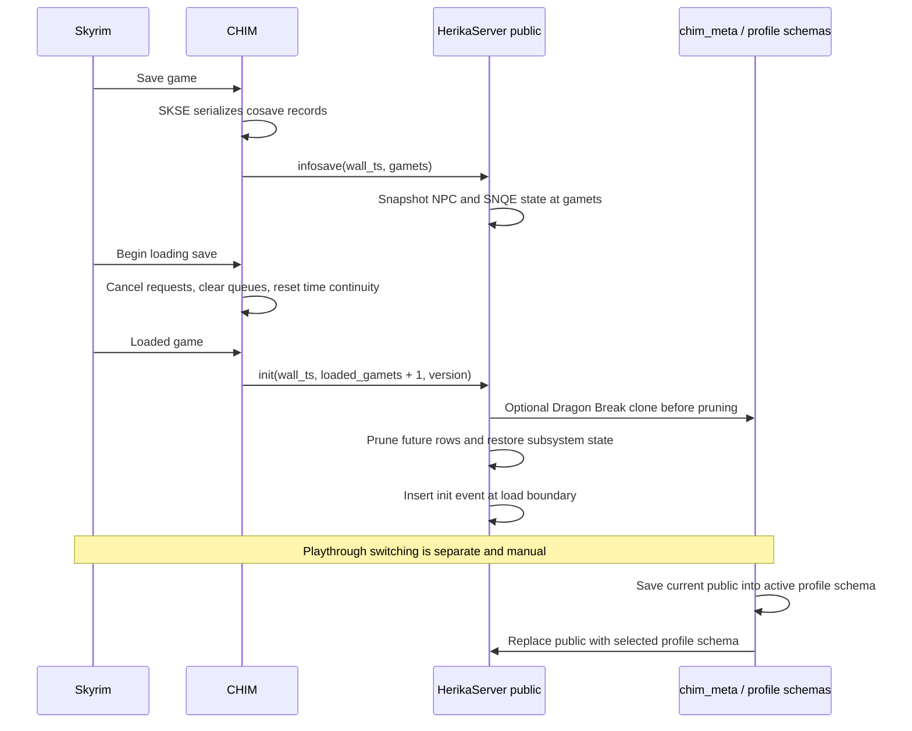

# Save, Load, Time, and Playthrough Management Specification

## Purpose

This document is the cross-repository contract for how CHIM and HerikaServer
manage narrative time, Skyrim saves, database rollback, safety snapshots, and
separate playthroughs.

It has two goals:

1. Describe the behavior that exists today so changes do not accidentally mix
   independent persistence systems or alter rollback boundaries.
2. Record the known gaps and the preferred direction for improving the system.

Sections labelled **Current behavior** describe the implementation. Sections
labelled **Recommended direction** are proposals and are not runtime guarantees.

## Scope

This specification covers:

- CHIM game-time and wall-time generation.
- Skyrim save, load, new-game, and death signals sent by the CHIM plugin.
- The SKSE cosave data owned by CHIM.
- HerikaServer timeline rollback after loading a save.
- NPC history, relationship history, memories, diaries, Background Life, and
  quest state affected by rollback.
- Dragon Break safety snapshots.
- Playthrough Manager schema snapshots and profile switching.

This specification does not define conversation routing, hearing, rechat, or
Prisma target selection. Those are covered by
`docs/conversation-routing-spec.md`.

## Terms

| Term | Meaning |
| --- | --- |
| wall timestamp | A high-resolution timestamp generated by CHIM for request ordering and operational cleanup. It is not the narrative timeline. |
| `gamets` | Tamriel game time represented as an integer with 10,000,000 units per in-game day. This is the canonical narrative timeline. |
| save boundary | The `gamets` value recorded when CHIM sends `infosave`. |
| load boundary | The value sent by CHIM in `init`, currently the loaded `gamets` plus one unit. |
| timeline rollback | Removing or restoring rows so live state matches an older loaded save. This occurs inside the active `public` schema. |
| SKSE cosave | Skyrim-side serialized CHIM data stored with a save by SKSE. It is separate from PostgreSQL. |
| live schema | The PostgreSQL `public` schema used by the running HerikaServer. |
| playthrough profile | A full cloned PostgreSQL schema named `chim_profile_*`, registered in `chim_meta.playthrough_profiles`. |
| Dragon Break | A safety clone of the live schema created before a sufficiently large backwards time jump is pruned. |
| locked NPC | An NPC whose profile lock protects current profile and biography data from normal timeline restoration. |

## State Ownership

CHIM does not have one monolithic save system. Four stores cooperate but have
different owners and lifecycles.

| Store | Owner | Primary contents | Save/load behavior |
| --- | --- | --- | --- |
| Runtime plugin state | CHIM | Queues, audio, active agents, request state, continuity counters | Cleared or rebuilt around Skyrim load events. Not durable by itself. |
| SKSE cosave | CHIM | Manually added AI agent FormIDs and renamed NPC mappings | Serialized and resolved by SKSE with the Skyrim save. |
| `public` PostgreSQL schema | HerikaServer | Events, NPCs, memories, diaries, relationships, quests, Background Life, configuration, connectors, and world knowledge | Rolled back in place when `init` reports an older `gamets`. |
| `chim_profile_*` schemas and `chim_meta` | HerikaServer Playthrough Manager | Full snapshots of `public` plus the profile registry | Switched manually while Skyrim and CHIM are stopped. |

The SKSE cosave and PostgreSQL database are complementary. Neither is a copy of
the other, and restoring one does not automatically restore the other.

## Time Model

### Wall timestamp

CHIM uses a high-resolution nanosecond timestamp for request identifiers and
wall-clock comparisons. The historical helper name `getCurrentTimeMillis()` is
misleading because it delegates to the nanosecond timestamp implementation.

Wall timestamps are operational metadata. They must not be used as the primary
authority for deciding which Tamriel events belong to a loaded save.

### Tamriel timestamp (`gamets`)

CHIM computes `gamets` from Skyrim's current game time:

```text
gamets = current_game_days * 10,000,000
```

The value is sent as an integer-like string and is the canonical narrative
timeline shared with HerikaServer.

During normal play, CHIM tracks continuity so a small unexpected backwards
movement does not silently make request timestamps regress. A Skyrim load calls
`ResetGameTimeStamp()`, which allows the next timestamp to establish a new
continuity baseline. This distinction is essential: a backwards jump during
normal play is suspicious, while a backwards jump immediately after loading an
older save is expected.

### Load-boundary offset

CHIM currently sends the loaded game timestamp as `gamets + 1` in the `init`
event.

The offset appears to be a boundary convention. HerikaServer deletes many rows
with `gamets >= load_boundary`; using `saved_gamets + 1` preserves rows and
snapshots recorded exactly at the save boundary while deleting later rows. This
rationale is inferred from the paired implementation and is not currently
represented by a named protocol constant.

## Lifecycle Overview



## CHIM Save and Load Protocol

### Save game

There are two independent save paths:

1. The SKSE serialization callback writes CHIM cosave records.
2. The CHIM save event sends `infosave|wall_ts|gamets` to HerikaServer.

On the first save before the plugin has completed its normal initialization,
CHIM initializes the narrator, player, and server connection instead of sending
`infosave`. Later saves send `infosave` normally.

HerikaServer handles `infosave` by:

1. Recording the event.
2. Calling `NpcMaster::backupAllNpcs(gamets)`.
3. Calling `SNQEQuestManager::save_quests(gamets)`.

An `infosave` event is therefore both an event-log marker and a snapshot trigger
for selected subsystems. It is not a full database snapshot.

### Begin loading

When Skyrim starts loading another save, CHIM:

- Cancels normal and rechat HTTP stream tasks.
- Clears response and audio queues.
- Resets renamed-NPC runtime state.
- Stops the main queue worker.
- Resets game-time continuity.
- Resets quest-bridge runtime state.
- Marks plugin initialization incomplete until the load finishes.

This prevents stale responses and stale runtime state from crossing the load
boundary. It does not itself mutate the HerikaServer database.

### Loaded game

After the save is loaded, CHIM:

- Resets time continuity again.
- Cancels any remaining stale work and refreshes runtime context.
- Rebuilds nearby, location, equipment, inventory, item, and player context.
- Sends `init|wall_ts|loaded_gamets_plus_one|plugin_version`.

The `init` event is the authoritative server rollback trigger. HerikaServer
does not infer a load solely from a backwards timestamp in ordinary dialogue.

### New game

CHIM resets time, timers, and quest-bridge state for a new game. The dedicated
`newgame` HTTP event is currently disabled in code.

A new Skyrim game does not automatically create or select a Playthrough Manager
profile. If the active `public` schema belongs to another character, the server
has no stable automatic identity handshake that can detect and resolve that
mismatch.

### Player death

CHIM sends `playerdied|wall_ts|gamets|...`, stops playback, and clears active
audio work.

HerikaServer contains a direct death-rollback path intended to find the latest
`infosave`. Its query selects `gamets`, but the subsequent code reads a field
named `ts`; therefore the direct rollback branch does not currently receive the
value it expects. In normal use, loading the post-death Skyrim save later sends
`init`, which performs the canonical rollback.

## SKSE Cosave Contract

CHIM currently serializes two record families:

| Record | Contents | Load behavior |
| --- | --- | --- |
| `AIAC` | FormIDs manually added as AI agents | Resolves FormIDs for the loaded save and re-adds the agents. |
| `AIAX` | Renamed NPC FormID, name, and source-mod mappings | Resolves FormIDs and restores runtime rename mappings. |

The cosave does not contain:

- Event history.
- Memories, summaries, or diaries.
- NPC profiles or connector settings.
- Relationships.
- Background Life state.
- Server quest tables.
- Playthrough Manager profile selection.

On SKSE revert, CHIM removes active agents from runtime. Database rollback still
waits for the server `init` protocol.

## HerikaServer `init` Rollback

### Rollback decision

HerikaServer reads the maximum positive `gamets` currently present in
`eventlog`. This is the previous narrative high-water mark.

Before destructive pruning, it calls the Dragon Break snapshot policy with:

- The previous event-log high-water mark.
- The incoming `init` load boundary.

Snapshot errors are logged and do not currently stop rollback.

### Current operation order

The current `init` handler performs these operations in sequence:

1. Ignore the special sentinel timestamp `10000000`.
2. Determine the previous maximum event timestamp.
3. Attempt a Dragon Break snapshot if the jump qualifies.
4. Delete rows considered later than the loaded save.
5. Reset CHIM Quest runtime state while preserving definitions.
6. Insert the new `init` event at the load boundary.
7. Remove old sound-cache files.
8. Restore NPC master state from history.
9. Clear pending relationship evaluation and initialization queues.
10. Restore SNQE quest state.
11. Continue narrator and startup behavior.

These operations are not coordinated by one explicit cross-subsystem database
transaction. A failure partway through can leave some subsystems restored and
others not restored.

## Rollback Policy Matrix

The following table describes the current behavior in `processor/comm.php` and
the subsystem restore functions.

| State | Current load policy | Boundary or exception |
| --- | --- | --- |
| `eventlog` | Delete future rows, then insert `init` | `gamets >= load_boundary`; wall rows after current request are also deleted. |
| `speech` | Delete future rows | `gamets >= load_boundary`; wall rows after current request are also deleted. |
| `currentmission` | Delete future rows | `gamets >= load_boundary`; wall rows after current request are also deleted. |
| `diarylog` | Delete future rows | `gamets >= load_boundary`; wall rows at or after current request are deleted. |
| `books` | Delete future rows | Uses the incoming load boundary and wall time. The current SQL prefixes the value with `0`, which should be treated as an implementation detail to audit. |
| `responselog` | Clear all | Not restored by timestamp. |
| `rolemaster` | Clear all | Not restored by timestamp. |
| `actions_issued` | Delete future rows | `gamets >= load_boundary`. |
| `moods_issued` | Delete future rows | `gamets >= load_boundary`. |
| `rumors` | Delete future rows | `gamets >= load_boundary`. |
| `named_cell` | Delete future and sufficiently old cache rows | Future rows use `>=`; old cache rows are older than the load boundary by 30,000,000 units. |
| `sneq_quests_saved` | Delete future snapshots, then load latest eligible snapshot | `gamets >= load_boundary`; the saved snapshot at the original save timestamp survives because `init` uses `save + 1`. |
| `bgl_history` | Delete future rows | `gamets >= load_boundary`. |
| `memory_summary` | Delete future rows | `gamets > load_boundary`. |
| `memory` | Delete future rows | `gamets > load_boundary`. |
| CHIM Quest runtime | Reset all runtime state | Definitions remain; runtime is not currently rolled back to the retained timestamped event set. |
| NPC master | Restore from history | Detailed below. |
| Relationship queues | Clear all pending async work | Prevents pre-load evaluations from being written after restoration. |
| Server configuration, connectors, profiles, Oghma | No timeline rollback inside `public` | They change only when a different playthrough schema is selected or the user edits them. |
| SKSE cosave | No server action | Loaded independently by CHIM/SKSE. |

The mixture of `>` and `>=` is current behavior, not a general rule. The
`gamets + 1` load boundary masks some differences but the boundary semantics
should not be changed without a complete subsystem review.

## NPC and Relationship History

### Save snapshot

`NpcMaster::backupAllNpcs(gamets)`:

1. Validates the timestamp.
2. Updates each current NPC's `gamets_last_updated` to the save timestamp.
3. Copies complete NPC rows into `core_npc_master_history`.
4. Marks the snapshot source as `infosave` in extended data.

Manual per-NPC history snapshots also exist and are marked with source
`manual`.

### Load restoration

`NpcMaster::restoreNPC(load_boundary)` restores the latest eligible historical
row at or before the target, preferring `infosave` snapshots and then the newest
creation time.

Current policy:

- Unlocked, non-narrator NPC rows from the future are removed and restored from
  eligible history.
- An unlocked NPC with no eligible historical row is not recreated. This lets
  NPCs discovered after the loaded save disappear from that older timeline.
- Locked NPC profile and biography state remains current instead of being
  replaced wholesale.
- Relationship fields for locked NPCs are handled separately and are restored
  from eligible history.
- Future relationship metadata is cleared.
- Background Life is disabled for all currently enabled NPCs after restoration.

Profile locking is therefore a deliberate timeline exception for authored NPC
identity, not a general exemption from relationship rollback.

Relationship restoration is active development. Changes to its durability must
preserve the invariant that loading an older save cannot allow queued pre-load
relationship work to overwrite the restored state.

## Quest State

CHIM currently has two separate server-side quest systems with different save
and load behavior.

### CHIM Quest runtime

The CHIM Quest engine has a timestamp-aware rollback function capable of
deleting future events, action outbox rows, and beat state before rebuilding
instances from retained events.

The main `init` handler does not currently use that function. It calls a full
runtime reset that:

- Deletes all quest action outbox rows.
- Deletes all quest events and beat state.
- Resets instances to inactive/default state.
- Preserves quest definitions.

### SNQE

On `infosave`, SNQE stores its live quest rows and serialized state when
`log/snqe_state.json` exists.

On `init`, SNQE:

1. Clears the live quest table.
2. Selects the latest saved row at or before the load boundary.
3. Restores that row and its serialized state file.
4. Removes the state file if no eligible snapshot exists.

The save path can insert multiple distinct quest rows, while the load query
currently returns one latest row total. Multi-quest restoration should be
audited before treating SNQE snapshots as a complete save-level set.

## Dragon Break Safety Snapshots

Dragon Break is enabled by default unless disabled in global settings. Its
default threshold is a backwards jump of at least three Tamriel days.

When the incoming load boundary is sufficiently older than the previous event
high-water mark, HerikaServer:

1. Creates a full clone of `public` under a unique `chim_profile_*` schema.
2. Adds a non-active Playthrough Manager record named for the old and new
   Tamriel dates.
3. Continues with normal timeline pruning.

Important current behavior:

- Snapshot failure is fail-open: rollback continues after logging the failure.
- The clone contains the complete live `public` schema, including configuration
  as well as gameplay data.
- If schema cloning succeeds but metadata insertion fails, an unregistered
  schema can remain.
- Dragon Break protects the pre-rollback database, not the CHIM SKSE cosave.

## Playthrough Manager

### Storage model

The running server always uses PostgreSQL schema `public`.

Playthrough Manager stores:

- Registry and metadata tables in schema `chim_meta`.
- One complete clone per playthrough under a sanitized `chim_profile_*` schema.

Because the clone is whole-schema, playthrough profiles currently include both
gameplay state and server configuration such as connectors, prompts, profiles,
and Oghma content.

### First use

Opening Playthrough Manager with no registered profiles automatically clones
the current `public` schema into an active profile named `default`. This is a
state-changing side effect of viewing the page.

### Create profile

Creating a profile clones the current `public` schema and records descriptive
metadata such as player name and notes. Player metadata does not establish an
automatic identity link with a Skyrim save or cosave.

### Switch profile

Switching is designed to occur while Skyrim and CHIM are stopped. The current
sequence is:

1. Clone current `public` back into the currently active profile schema.
2. Abort if that autosave fails.
3. Drop and recreate `public` with required extensions.
4. Clone the selected profile schema into `public`.
5. Mark the selected profile active and all others inactive.
6. Truncate `public.database_versioning` so functions and views are rebuilt.
7. Restart HerikaServer and Skyrim against the selected live schema.

The schema clone must preserve explicit identity values, sequence ownership,
column defaults, and each sequence's next usable value. Cloning rows without
synchronizing sequences can cause later inserts to reuse existing IDs.

### Delete profile

Playthrough Manager refuses to delete the active profile and the protected
`default` profile. For an allowed deletion, it drops the profile schema and
then removes the registry entry.

### Failure characteristics

The switch is not currently staged as one recoverable swap:

- Saving the active playthrough drops its previous profile schema before the
  replacement clone is complete.
- Loading the target drops and recreates `public` before the target clone has
  been fully validated.
- A target-clone failure can leave `public` empty or incomplete until manually
  recovered from a retained profile schema.

The page retains legacy dump and large-object restore paths for compatibility
with older playthrough data.

## Save Identity and Playthrough Identity

Current CHIM/HerikaServer behavior has no durable automatic association among:

- A Skyrim character.
- A specific Skyrim save.
- The matching SKSE cosave.
- A Playthrough Manager profile schema.

`gamets` can restore an older point within the currently active live schema,
but it cannot prove that the loaded Skyrim save belongs to that schema. Loading
a save from another character while the wrong playthrough profile is active can
therefore mix game-side state with the active server database.

This is the most important distinction for agents working in this area:

- **Timeline rollback** moves backwards within the active `public` schema.
- **Playthrough switching** replaces the entire active `public` schema.

They are not interchangeable.

## Required Invariants

Changes in this subsystem must preserve these invariants unless this
specification is deliberately revised:

1. `gamets` is the authority for narrative rollback; wall time is operational
   metadata only.
2. A backwards timestamp is accepted as a new baseline only around an explicit
   Skyrim load lifecycle.
3. `init` is the canonical server rollback trigger.
4. Rows and snapshots recorded exactly at the save boundary must survive loading
   that save.
5. Dragon Break snapshot evaluation occurs before destructive timeline pruning.
6. SKSE cosave data and PostgreSQL data remain separate, complementary stores.
7. Pending relationship work is cleared before it can overwrite restored data.
8. Locked NPC profile identity is preserved while timeline-dependent
   relationship state follows the documented restoration policy.
9. The live server reads and writes `public`; `chim_meta` must survive public
   schema replacement.
10. A schema clone must preserve explicit IDs and synchronize sequence values.
11. Playthrough switching saves the current active playthrough before replacing
   live state, or aborts without replacing it.
12. No system may silently assume a Skyrim save belongs to the active
   playthrough profile without a verified identity link.

## Diagnostics

When investigating a save/load or playthrough report, collect evidence from all
relevant layers.

### CHIM plugin log

Confirm:

- Plugin version and startup sequence.
- `OnLoadingGame`, `OnLoadedGame`, and save callbacks occurred in the expected
  order.
- The `init`, `infosave`, or `playerdied` event contains the expected `gamets`.
- Stale HTTP and audio tasks were cancelled around the load.
- SKSE serialization loaded and resolved expected FormIDs.

### HerikaServer log

Confirm:

- Incoming event type and load boundary.
- Previous maximum event `gamets`.
- Dragon Break decision and snapshot profile ID or failure.
- SQL prune failures or partial restore warnings.
- NPC restore counts and relationship queue cleanup.
- Quest reset/load result.

### Database checks

Confirm:

- Maximum positive `eventlog.gamets` before and after load.
- Presence of the expected `infosave` snapshot at the original save boundary.
- Future rows remaining in any timestamped subsystem.
- Latest eligible `core_npc_master_history` rows for affected NPCs.
- Active Playthrough Manager registry row and actual live schema contents.
- Profile schema sequence values after clone or switch.

### Evidence rule

Do not diagnose a current rollback bug using only old server logs or one table.
Correlate the Skyrim load timestamp, CHIM event, HerikaServer rollback log, and
database state from the same reproduction.

## Current Limitations and Known Discrepancies

1. The first save used to initialize CHIM may not emit `infosave`.
2. `getCurrentTimeMillis()` is named as milliseconds but returns the nanosecond
   timestamp helper.
3. The `gamets + 1` load boundary is an implicit convention rather than a named,
   shared protocol rule.
4. Rollback spans many statements and subsystem callbacks without one explicit
   cross-system transaction.
5. Cutoffs differ between `>` and `>=` across tables.
6. Player-death direct rollback reads a different field name than its query
   returns.
7. CHIM Quest runtime is fully reset on load even though timestamp rollback code
   exists.
8. SNQE restoration appears to select one latest row rather than a complete
   save-level quest set.
9. Locked NPCs intentionally retain current authored fields while relationship
   data follows a different restoration path.
10. Loading an older save disables Background Life for restored active NPCs.
11. Dragon Break snapshot failure does not block destructive rollback.
12. Dragon Break can leave an orphan schema if registry insertion fails.
13. Opening Playthrough Manager for the first time mutates state by creating the
   default profile.
14. Playthrough switching drops destinations before replacement clones are
   validated and is not an atomic recoverable swap.
15. Playthrough profiles clone configuration and gameplay data together.
16. There is no automatic Skyrim-save-to-playthrough identity association.
17. New game does not send a dedicated active server protocol or automatically
   select a clean playthrough profile.

## Recommended Direction

The following roadmap is intentionally separate from current behavior.

### Priority 0: Make destructive operations coherent

1. Introduce one server rollback coordinator with an explicit per-subsystem
   policy and transaction boundaries. It should report row counts and abort or
   recover cleanly when a required stage fails.
2. Make `init` the only canonical timeline rollback authority. Remove the
   duplicated player-death rollback attempt or make it call the same coordinator
   idempotently.
3. Use CHIM Quest's timestamp-aware rollback on load instead of deleting all
   retained runtime history.
4. Stage Playthrough Manager clones under temporary schemas, validate them, and
   only then replace the destination. Never destroy the last known-good active
   profile or live schema before its replacement is verified.

### Priority 1: Establish identity and normalize policy

1. Add a stable handshake carrying character identity, save identity, and
   cosave identity from CHIM. When it does not match the active server profile,
   prompt the user to select or create a playthrough instead of silently mixing
   state.
2. Move Playthrough Manager bootstrap and metadata migrations out of page-view
   GET behavior into explicit setup or database migrations.
3. Define named inclusive/exclusive cutoff helpers and normalize each table only
   after confirming save-boundary expectations.
4. Make Dragon Break failure policy explicit. For large rollback, support a
   fail-closed option and remove orphan schemas after registry failure.
5. Store and restore SNQE snapshots as complete save-level sets.
6. Add an explicit new-game protocol that can initialize or select a clean
   playthrough safely.

### Priority 2: Improve visibility and product choices

1. Record a structured rollback audit containing from/to `gamets`, source event,
   snapshot ID, table counts, duration, warnings, and final status.
2. Add Playthrough Manager preflight checks and a dry-run view for schema health,
   required extensions, clone compatibility, and recovery source.
3. Decide which configuration is global to the installation and which data is
   playthrough-specific. If connectors, API settings, or shared Oghma content
   should persist globally, move them out of whole-schema profile snapshots
   through a deliberate migration.
4. Expose a clear warning when the loaded Skyrim identity cannot be verified
   against the active server playthrough.

## Acceptance Scenarios

### Save and reload the same save

1. CHIM sends `infosave` at `gamets G`.
2. NPC and eligible quest snapshots are stored at `G`.
3. Loading the save sends `init` at `G + 1`.
4. Data at `G` remains.
5. Data created after `G` is pruned or restored according to the matrix.
6. No stale response or relationship task writes post-load state from the old
   runtime.

### Load an older save in the same playthrough

1. Incoming `init` is older than the event-log high-water mark.
2. Dragon Break policy is evaluated before pruning.
3. Future events, memories, diaries, NPC state, Background Life history, and
   quest state follow their documented policies.
4. Locked NPC authored state and relationship history follow their separate
   rules.
5. The active Playthrough Manager profile does not change.

### Load a save from another character

Current expected result:

- CHIM can send an older or newer `gamets`, but the server cannot prove the
  character belongs to the active profile.
- The user must manually select the correct Playthrough Manager profile before
  normal use.

Recommended future result:

- Identity mismatch is detected before destructive rollback or new writes.
- The user is offered a safe profile selection or creation flow.

### Switch playthrough profile

1. Skyrim and CHIM are stopped.
2. Current `public` is saved to the active profile schema.
3. The target profile is validated.
4. `public` is replaced by the target clone.
5. Sequence state, views, functions, extensions, and database versioning are
   valid before restart.
6. Only the selected profile is marked active.

### Clone with identity columns

1. Rows retain their explicit identity values.
2. Sequence ownership and defaults point to sequences in the destination schema.
3. The next insert uses an unused value greater than or otherwise valid relative
   to cloned rows.

### Rollback failure

Current expected result:

- Errors are logged, but some operations may already have completed.

Recommended future result:

- The rollback audit identifies the failed stage.
- Required state is committed together or restored from the preflight snapshot.
- The server does not resume normal writes against partially restored state.

## Source References

### CHIM

- `Plugin/Misc.cpp`
  - Wall timestamp generation.
  - `gamets` calculation and continuity handling.
  - `ResetGameTimeStamp()`.
- `Plugin/Plugin.cpp`
  - SKSE serialization save, load, and revert callbacks.
  - Save-game `infosave` emission.
  - `OnLoadingGame`, `OnLoadedGame`, and `OnNewGame` lifecycle behavior.
  - Player-death event emission.

### HerikaServer

- `processor/comm.php`
  - `init`, `infosave`, and `playerdied` handlers.
  - Timeline prune order and table boundaries.
- `lib/utils_game_timestamp.php`
  - Event-log high-water timestamp lookup.
- `lib/core/npc_master.class.php`
  - NPC save snapshots and timeline restoration.
- `lib/chim_quest_engine.php`
  - CHIM Quest timestamp rollback and full runtime reset behavior.
- `service/processors/snqe/lib/snqe.class.php`
  - SNQE save and restore behavior.
- `lib/playthrough_snapshot.php`
  - Dragon Break qualification and snapshot creation.
- `ui/playthrough_manager.php`
  - Profile create, switch, delete, and default bootstrap behavior.
- `lib/playthrough_schema.php`
  - Schema clone, public recreation, and version-gated clone-function setup.
- `lib/schema_clone_function.sql`
  - Table, sequence, identity, ownership, default, view, and sequence-value
    cloning behavior.
